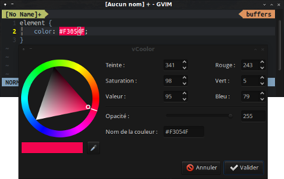
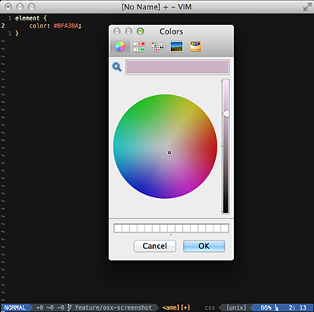

vCoolor - Simple color selector/picker plugin for Vim.
======================================================

Description
-----------

vCoolor is a Vim plugin that allows using a color picker/selector directly from the editor.

What this plugin do:

* Insert hex, rgb or hsl color anywhere.
* Modify hex color even if there are many colors in 1 line.
* Modify a rgb color with 0-255 values or % (Only one by line).
* Modify a hsl color (Only one by line).

What this plugin doesn't do:

* Insert or modify rgba or hsla colors.

In GNU/Linux it uses a simple GTK+ dialog via [Yad](http://sourceforge.net/projects/yad-dialog/).

In windows it uses [colorpicker-windows-commandline](https://github.com/jaxbot/colorpicker-windows-commandline) (The binary is included in the plugin).

In Mac OSX it uses a [ruby script](https://github.com/KabbAmine/vCoolor.vim/tree/master/osx/color-picker) to trigger the system color picker:

Installation
-------------

To use vCoolor in GNU/Linux, you need to have [Zenity](https://wiki.gnome.org/action/show/Projects/Zenity) (Included in most distributions) or [Yad](http://sourceforge.net/projects/yad-dialog/) (If you compile it manually, do it with GTK2 to avoid problem [#1](https://github.com/KabbAmine/vCoolor.vim/issues/1))

### Manual installation

Install the distributed files into Vim runtime directory which is usually `~/.vim/`, or `$HOME/vimfiles` on Windows.

### Using Pathogen
If you're using pathogen, extract the files into `bundle` directory.

### Using Vundle (Best way)
Just add the following line in the Vundle part of your vimrc:
    
	Plugin 'KabbAmine/vCoolor.vim'

Then proceed to the installation of the plugin with the following command:

	:PluginInstall

Usage
-----

In both NORMAL and INSERT modes, only 1 shortcut is needed: `<Alt-C>` (I find it very convenient :D), but he may be not working on terminal.

Use it:

* To insert a color anywhere.
* To modify the current hex, rgb or hsl color.

Using `<Alt-R>` you can insert a rgb color anywhere (NORMAL and INSERT modes).

Using `<Alt-V>` you can insert a hsl color anywhere (NORMAL and INSERT modes).

Click on the image for a short screencast.

Commands
--------

You can execute vCoolor with:

	:VCoolor
    :VCoolorR		" For rgb color insertion
    :VCoolorH		" For hsl color insertion

Also, I've used some color conversion commands for debug purpose but I finally decided to keep them in the plugin, they may be useful.

Here they are with exemples to understand how they work:

	:Rgb2Hex "255, 0, 255"			" Gives "#FF00FF"
	:Rgb2RgbPerc "255, 0, 255"		" Gives "100%, 0%, 100%"
    :Rgb2Hsl "255, 0, 255"			" Gives "300, 100%, 50%"

    :RgbPerc2Hex "100%, 0%, 100%"	" Gives "#FF00FF"
	:RgbPerc2Rgb "100%, 0%, 100%"	" Gives "255, 0, 255"

    :Hex2Lit "#FF00FF"				" Gives "magenta"
	:Hex2Rgb "#FF00FF"				" Gives "255, 0, 255"
	:Hex2RgbPerc "#FF00FF"			" Gives "100%, 0%, 100%"
    :Hex2Hsl "#FF00FF"				" Gives "300, 100%, 50%"

    :Hsl2Rgb "300, 100%, 50%"		" Gives "255, 0, 255"
    :Hsl2Hex "300, 100%, 50%"		" Gives "#FF00FF"

Mapping
-------

To change the mapping by default, add to your *vimrc*.

	" For NORMAL mode
	nmap <NEW_MAPPING> <Plug>vCoolorC " Or
	nmap <NEW_MAPPING> :VCoolor<CR>
	
    " For INSERT mode
    imap <NEW_MAPPING> <Plug>vCoolorI " INSERT mode

For rgb color insertion

	" For NORMAL mode
	nmap <NEW_MAPPING> <Plug>vCoolorRC " Or
	nmap <NEW_MAPPING> :VCoolorR<CR>
	
    " For INSERT mode
    imap <NEW_MAPPING> <Plug>vCoolorRI " INSERT mode

And for hsl color insertion

	" For NORMAL mode
	nmap <NEW_MAPPING> <Plug>vCoolorHC " Or
	nmap <NEW_MAPPING> :VCoolorH<CR>
	
    " For INSERT mode
    imap <NEW_MAPPING> <Plug>vCoolorHI " INSERT mode

You can use the same mapping for both modes.

TODO
----

- ~~Windows alternative~~.
- ~~MAC OS alternative~~.
- A better regex patterns.
- ~~Handle rgb(%).~~
- ~~Handle hsl.~~
- Handle rgba and hsla colors.
- Add possibility to modify 2 or more rgb colors in a line.
- ~~Add a vim doc file.~~
- ~~Insert a rgb color.~~

Notes
-------------

I'm not very happy with the GTK selection color dialog via Yad (Very limited), but I didn't find a good alternative, I think that I can use python with pygtk but I prefer to stick with pure vimscript and the default unix shell (Bash in my case), so if you aware of something better, let me know.

Thanks
-------

To Yad's author.

To Bram Moolenaar for creating the best piece of software in the world :D

To Jonathan Warner alias [jaxbot](https://github.com/jaxbot) for his contribution.

To you if you're using vCoolor.
